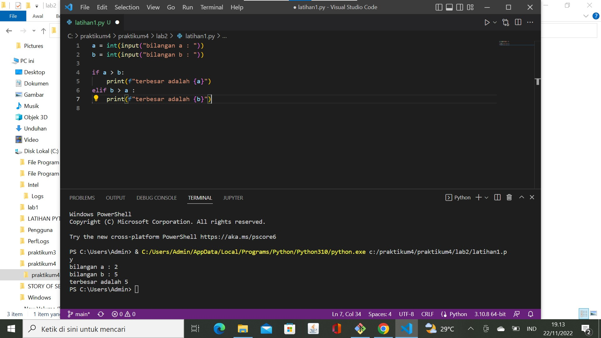
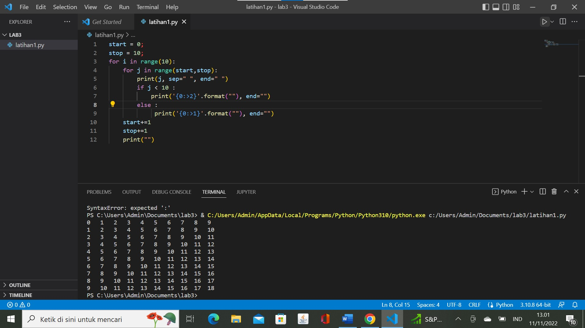
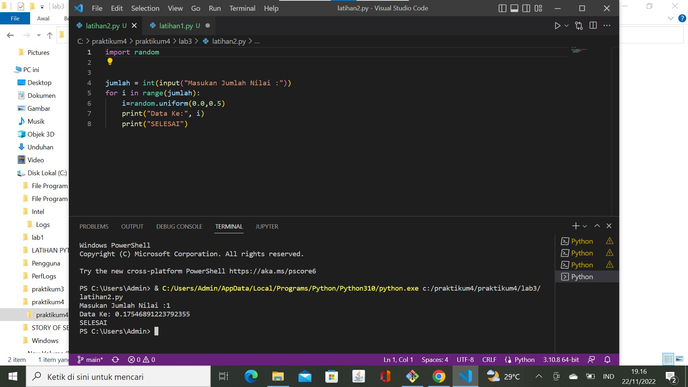

# Praktikum4
# Lab2 Struktur Kondisi
# LATIHAN1
MEMBUAT PROGRAM SEDERHANA DENGAN MENGINPUT 2 BUAH BILANGAN UNTUK MENENTUKAN BILANGAN TERBESAR MENGGUNAKAN STATEMENT IF
Berikut adalah tampilan source code

# LATIHAN2
MEMBUAT PROGRAM MENGURUTKAN DATA BERDASARKAN INPUT SEJUMLAH DATA (MINIMAL 3 VARIABEL INPUT ATAU LEBIH),KEMUDIAN MENAMPILKAN HASIL DENGAN URUT DARI DATA TERKECIL
Berikut adalah tampilan source code

# Lab3 Perulangan
# LATIHAN1
PEROGRAM MEMBUAT DENGAN PERULANGAN BERTINGKAT(NESTED)

# LATIHAN2
MENAMPILKAN DAN BILANGAN ACAK ACAK YANG LEBIH KECIL DARI 0,5 DAN NILAI n DIISI PADA SAAT RUNTIME MENGGUNAKAN KOMBINASI WHILE DAN FOR
Berikut adalah tampilan source code

